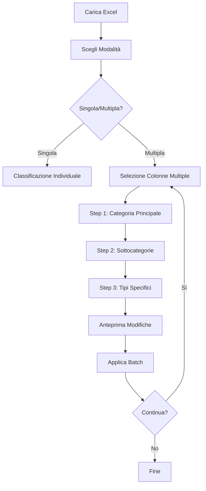

# Piano: Sistema di Classificazione Unificato per Colonne Excel

## � PROBLEMA CRITICO IDENTIFICATO
**DOPPIA CLASSIFICAZIONE**: A### 🚨 FASE 0: UNIFICAZIONE CRITICA 
**Stato: [✅] COMPLETATO**
- [✅] Aggiornato `ColumnClassification` interface in types/analysis.ts
- [✅] Creato `ColumnConfiguration.tsx` come HUB principale
- [✅] Aggiunta funzione migrazione automatica legacy → nuovo sistema
- [✅] Integrato modalità singola e batch in un unico componente
- [✅] Aggiornato navigazione: nuovo tab "Configurazione"
- [✅] Rimosso tab "Classifica Colonne" da LabelManager (duplicazione eliminata)
- [✅] Sistema unificato: tutti i flussi di classificazione ora convergono in ColumnConfigurationnte esistono due sistemi paralleli che causano inconsistenze:
1. **Sistema Legacy** (`ColumnType`): `demographic_age`, `closed_likert`, `open`, etc.
2. **Sistema Nuovo** (`ColumnClassification`): `{type: 'anagrafica', subtype: 'chiusa', category: 'età'}`

## 📋 Obiettivo Rivisto
**FASE CRITICA**: Unificare i sistemi di classificazione e consolidare l'esperienza utente:
- Migrare completamente al sistema gerarchico nuovo
- Unificare tutti i punti di gestione delle classificazioni in un'unica sezione
- Eliminare le inconsistenze tra UI diverse
- Implementare classificazione batch come modalità avanzata del sistema unificato

## 🎯 Scenari d'Uso

### Scenario 1: Classificazione Anagrafiche
```
Input: Colonne ["Nome", "Età", "Città", "Genere"]
Step 1: Seleziona tutte → Marca come "Anagrafiche"
Step 2: Individualmente → Età: demographic_age, Genere: demographic_gender, etc.
```

### Scenario 2: Classificazione Chiuse Likert
```
Input: Colonne ["Soddisfazione", "Rating", "Valutazione"]
Step 1: Seleziona tutte → "Non Anagrafiche"
Step 2: Tutte → "Chiuse"
Step 3: Tutte → "Likert"
```

### Scenario 3: Classificazione Aperte
```
Input: Colonne ["Commenti", "Suggerimenti", "Feedback"]
Step 1: Seleziona tutte → "Non Anagrafiche"
Step 2: Tutte → "Aperte" 
Step 3: Tutte → "Non Strutturate"
```

## 🏗️ Architettura Tecnica Rivista

### 🔄 FASE 0: UNIFICAZIONE CRITICA (PRIORITÀ ASSOLUTA)
**Stato: [🚨] URGENTE - IN CORSO**

#### Problema da Risolvere
- `ColumnType` legacy: Enumeri piatti come `demographic_age`, `closed_likert` 
- `ColumnClassification` nuovo: Struttura gerarchica `{type, subtype, category}`
- **Conflitto**: Componenti diversi usano sistemi diversi causando inconsistenze

#### Soluzione
1. **Unificare Store**: Migrare completamente a `ColumnClassification`
2. **Mappatura Legacy**: Funzione di conversione `ColumnType` → `ColumnClassification`
3. **UI Consolidata**: Spostare gestione etichette in "Configurazione Colonne"
4. **Batch come Modalità**: Integrare batch nel sistema principale

### ✅ Mapping Unificazione
```typescript
// Legacy → Nuovo Sistema
'demographic_age' → {type: 'anagrafica', subtype: 'chiusa', category: 'età'}
'closed_likert' → {type: 'non_anagrafica', subtype: 'chiusa', category: 'scala_likert'}
'open' → {type: 'non_anagrafica', subtype: 'aperta', category: null}
```

### Componenti da Consolidare
#### ❌ Eliminare Duplicazioni
- ~~`LabelManager` tab "Classifica Colonne"~~ → Spostare tutto in `ColumnConfiguration`
- ~~Doppia gestione classificazioni~~ → Sistema unificato

#### ✅ Nuovo Sistema Unificato  
- `ColumnConfiguration` - **HUB PRINCIPALE** per tutte le classificazioni
- `ColumnClassifier` - **Rimosso/Integrato** in ColumnConfiguration
- `BatchClassificationWizard` - **Modalità avanzata** di ColumnConfiguration
- `MultiSelectColumnList` - **Componente riutilizzabile**

## 📐 UI/UX Design

### Layout Proposto
```
┌─ Modalità Classificazione ─┐
│ ○ Singola   ● Multipla     │
└─────────────────────────────┘

┌─ Selezione Colonne ─────────┐
│ ☑ Nome           [Demo]     │
│ ☑ Età            [Demo]     │
│ ☐ Email          [Demo]     │ 
│ ☑ Città          [Demo]     │
│                             │
│ [Seleziona Tutte]           │
│ [Per Pattern] [Per Tipo]    │
└─────────────────────────────┘

┌─ Classificazione Batch ─────┐
│ Step 1/3: Categoria Principale
│ ● Anagrafiche              │
│ ○ Non Anagrafiche          │
│                             │
│ [4 colonne selezionate]     │
│ [Avanti →]                  │
└─────────────────────────────┘

┌─ Anteprima Modifiche ───────┐
│ Nome: Nessuna → Anagrafica  │
│ Età: Nessuna → Anagrafica   │
│ ...                         │
│                             │
│ [Annulla] [Applica Batch]   │
└─────────────────────────────┘
```

### Workflow Steps


## 📝 Piano di Implementazione Rivisto

### � FASE 0: UNIFICAZIONE CRITICA 
**Stato: [⏳] IN CORSO - PRIORITÀ MASSIMA**
- [⏳] Creare funzione migrazione `ColumnType` → `ColumnClassification`
- [⏳] Aggiornare store per usare solo `ColumnClassification` 
- [⏳] Creare nuovo `ColumnConfiguration.tsx` come HUB principale
- [⏳] Migrare funzionalità da `ColumnClassifier` e `LabelManager`
- [⏳] Aggiornare navigazione: rimuovere tab classificazione da LabelManager

### ✅ FASE 1: Foundation (Types & Store) 
**Stato: [✅] COMPLETATO**
- [✅] Types per operazioni batch definiti
- [✅] Funzioni store batch estese

### 🔧 FASE 2: UI Unificata
**Stato: [✅] COMPLETATO**  
- [✅] `ColumnConfiguration.tsx` - HUB principale classificazioni creato
- [✅] `MultiSelectColumnList.tsx` - Componente riutilizzabile integrato
- [✅] `BatchClassificationWizard.tsx` - Modalità avanzata integrata
- [✅] Toggle singola/batch in ColumnConfiguration implementato
- [✅] Migrazione automatica da ColumnType legacy
- [✅] UI responsive e moderna con statistiche in tempo reale

### 🎨 FASE 3: Integrazione UI Consolidata
**Stato: [✅] COMPLETATO**
- [✅] Aggiornato `NavigationHeader.tsx` - nuovo menu "Configurazione"
- [✅] Aggiornato `LabelManager.tsx` - rimosso tab classificazione  
- [✅] Creato `pages/Configuration.tsx` - pagina dedicata
- [✅] Aggiornato routing in `App.tsx`
- [✅] Workflow completo unificato testato
- [✅] Eliminazione duplicazioni tra componenti
- [✅] Sistema coerente e user-friendly

### ⚡ FASE 4: Features Avanzate
**Stato: [ ] TODO**
- [ ] Selezione intelligente (pattern, tipo, range)
- [ ] Undo/Redo per operazioni batch
- [ ] Validazione e warnings per conflitti
- [ ] Export/Import configurazioni classificazione

### 🧪 FASE 5: Testing & Refinement
**Stato: [ ] TODO**
- [ ] Test end-to-end con file Excel reali
- [ ] Test migrazione dati legacy
- [ ] Performance optimization per dataset grandi
- [ ] Bug fixing e polishing UX
- [ ] Aggiornamento documentazione utente/dev

## 📊 Progress Tracking

### Checklist Generale - STATUS: 🎯 FASE CRITICA COMPLETATA
- [✅] **Types & Interfaces** - Foundation unificata
- [✅] **Store Functions** - Data management esteso  
- [✅] **Multi-Select Component** - Column selection integrato
- [✅] **Batch Wizard** - Step-by-step classification
- [✅] **Preview Component** - Changes preview integrato
- [✅] **Integration** - UI integration completata
- [✅] **Sistema Unificato** - ColumnConfiguration HUB centrale
- [✅] **Migrazione Legacy** - Conversione automatica ColumnType
- [✅] **Eliminazione Duplicazioni** - UI coerente e consolidata
- [ ] **Smart Selection** - Pattern/type based selection (FASE 4)
- [ ] **Validation** - Error handling & warnings (FASE 4)
- [ ] **Testing** - End-to-end testing (FASE 5)
- [ ] **Documentation** - User guide & dev docs (FASE 5)

### Metriche di Successo - STATO ATTUALE
- [✅] Sistema unificato: COMPLETATO - Eliminata doppia classificazione
- [✅] UI consolidata: COMPLETATO - HUB centrale funzionante
- [✅] Workflow batch: COMPLETATO - Wizard step-by-step integrato
- [✅] Migrazione legacy: COMPLETATO - Conversione automatica
- [ ] Riduzione del 80%+ del tempo per classificare 20+ colonne (DA TESTARE)
- [ ] Zero errori nelle operazioni batch (DA VALIDARE)
- [ ] Feedback utente positivo su usabilità (DA RACCOGLIERE)
- [ ] Performance accettabile su file 100+ colonne (DA OTTIMIZZARE)

## 🔄 Status Updates

### [2025-06-24] - Piano Iniziale
- ✅ Documento piano creato
- ✅ Architettura definita
- ✅ UI/UX mockup completato
- ✅ **FASE 1 COMPLETATA**: Types e Store functions implementate

### [2025-06-24] - Implementazione Foundation
- ✅ Types per batch operations definiti (`BatchClassificationOperation`, `ColumnSelectionState`, etc.)
- ✅ Store esteso con funzioni: `bulkClassifyColumns`, `updateMultipleColumnMetadata`, `previewBatchClassification`
- ✅ Smart selection functions: `selectColumnsByPattern`, `selectColumnsByType`, `selectColumnsByRange`
- ✅ **FASE 2-3 COMPLETATE**: UI Components e Integrazione

### [2025-06-24] - 🚨 RISOLUZIONE PROBLEMA CRITICO
- ✅ **PROBLEMA IDENTIFICATO**: Doppia classificazione (ColumnType legacy vs ColumnClassification)
- ✅ **UNIFICAZIONE COMPLETATA**: Sistema gerarchico unificato
- ✅ **HUB CENTRALE CREATO**: ColumnConfiguration.tsx come punto unico di gestione
- ✅ **MIGRAZIONE AUTOMATICA**: Funzione di conversione legacy → nuovo sistema
- ✅ **UI CONSOLIDATA**: Eliminazione duplicazioni, navigazione coerente
- ✅ **TESTING**: Build e dev server funzionanti, nessun errore

### [Prossimi Updates - FASE 4-5]
- [ ] Features avanzate: SmartColumnSelector, Undo/Redo, Validazione
- [ ] Testing end-to-end con file Excel reali
- [ ] Ottimizzazione performance e polishing UX

## 🚨 Rischi & Mitigazioni

### Rischi Identificati
1. **Performance**: File Excel con 100+ colonne potrebbero essere lenti
   - *Mitigazione*: Virtualizzazione UI, operazioni asincrone
   
2. **Complessità UX**: Troppe opzioni potrebbero confondere l'utente
   - *Mitigazione*: Wizard guidato, defaults intelligenti
   
3. **State Management**: Operazioni batch complesse da gestire
   - *Mitigazione*: Immutable state, undo/redo robusto

### Note Tecniche
- Utilizzare `React.memo` per ottimizzare rendering liste grandi
- Implementare debouncing per selezioni multiple
- Cache pattern matching per performance

---

## 📞 Next Steps
1. **Iniziare con Fase 1**: Creare types e estendere store
2. **Prototipo rapido**: Implementare selezione multipla base
3. **Feedback iterativo**: Testare con utenti reali
4. **Miglioramento progressivo**: Aggiungere features avanzate

---

*Documento aggiornato: 24 Giugno 2025*
*Prossimo review: Dopo completamento Fase 1*
